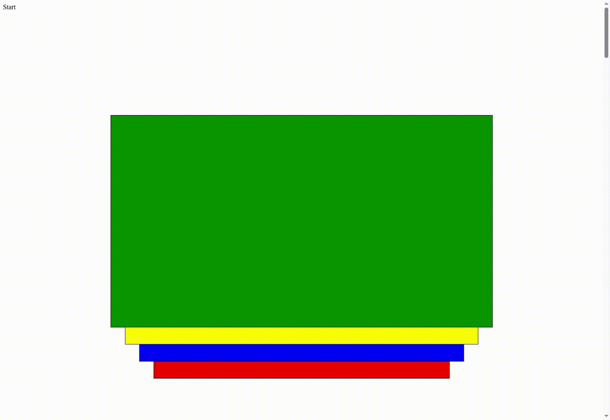

# Sticky card stack

React sticky card stack with GSAP ScrollTrigger and Lenis smooth scroll. Build a vertical stack of cards that stick and scale on scroll.

## ✨ Demo



## Install

```bash
npm install sticky-card-stack
```

Peer dependencies (install if you don't have them):

```bash
npm install react react-dom gsap lenis
```

## Quick start

1. **Import the library CSS once** (e.g. in your root entry or layout). Without this, cards will not be laid out or styled.
2. Call **`useScrollTrigger()`** once at your app root (e.g. in your root layout or main component).
3. Wrap your cards in **`StickyCardStack`** and use **`StickyCard`** for each card.

```tsx
import { StickyCardStack, StickyCard, useScrollTrigger } from 'sticky-card-stack';
import 'sticky-card-stack/style.css';  // required

function App() {
  useScrollTrigger();

  return (
    <StickyCardStack scrollHeight={8}>
      <StickyCard>
        <YourComponentA />
      </StickyCard>
      <StickyCard>
        <YourComponentB />
      </StickyCard>
    </StickyCardStack>
  );
}
```

All library CSS classes use the **`scs-`** prefix (e.g. `scs-wrap`, `scs-stack`, `scs-card-demo`) so they won't clash with your own styles. The stack works inside your own layout (e.g. a main column or grid); the CSS is scoped so it won't be overridden by typical container styles.

## API

### `useScrollTrigger()`

Call once at the root of your app. Sets up Lenis smooth scroll and syncs it with GSAP ScrollTrigger. Required for `StickyCardStack` to work correctly.

### `StickyCardStack`

| Prop            | Type       | Default | Description |
|-----------------|------------|---------|-------------|
| `children`      | `ReactNode`| —       | Card elements (e.g. `StickyCard` components). |
| `scrollHeight`  | `number`   | `8`     | Height of the scroll area as a multiple of viewport height. |
| `cardYOffset`   | `number`   | `5`     | Vertical offset between stacked cards (percent). |
| `cardScaleStep` | `number`   | `0.075` | Scale reduction per card (e.g. 0.075 = 7.5% smaller per card). |
| `className`     | `string`   | —       | Optional class name for the wrapper. |
| `colorVariants` | `string[]` | —       | Optional background colors applied per card by index (cycles if fewer than cards). |

### `StickyCard`
- **`children`** ReactNode; You structure the card yourself.
- **`colorOverride`** — Optional hex (or other) color for this card; overrides stack variant/`colorVariants`.

Example with custom layout:

```tsx
<StickyCard colorOverride="#1a1a2e">
  <div className="my-card">…</div>
</StickyCard>
```

## TypeScript

Exported types:

- `StickyCardStackProps`
- `StickyCardProps`
- `STICKY_CARD_STACK_DEFAULTS`


## License

MIT
